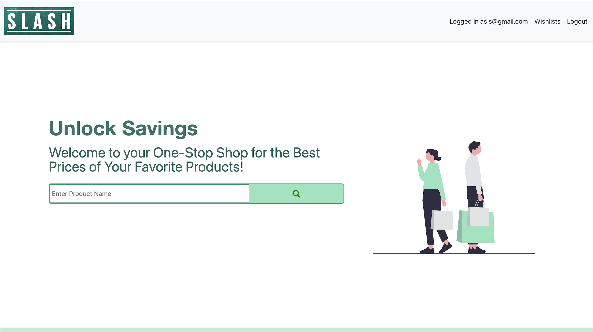
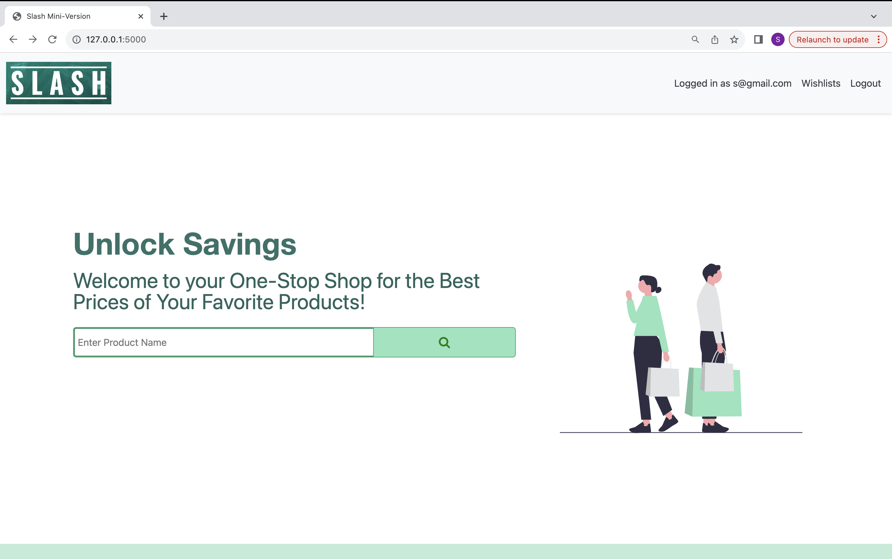
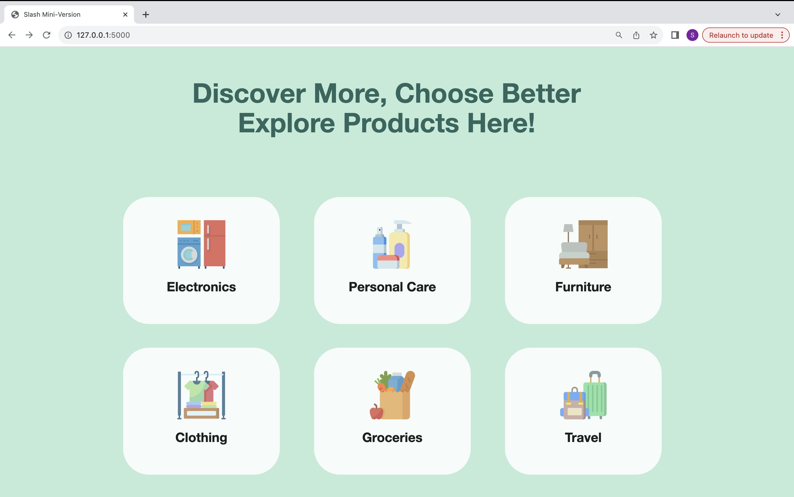
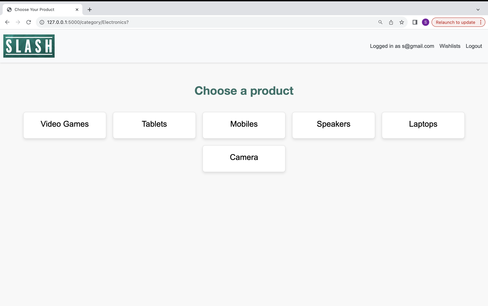
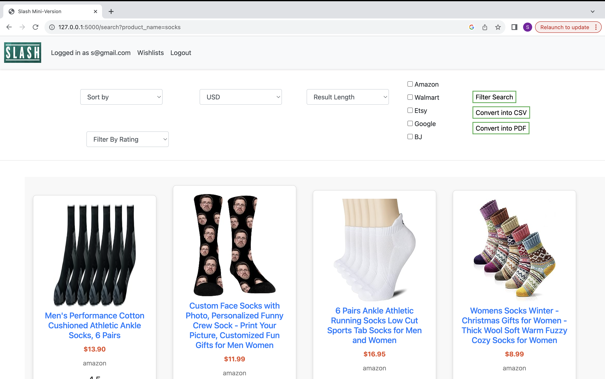
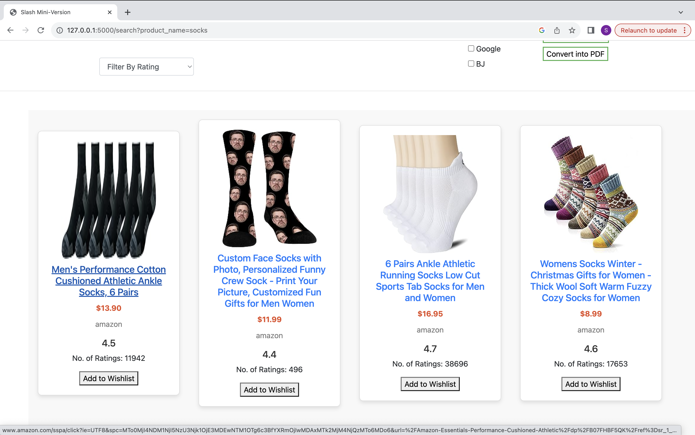
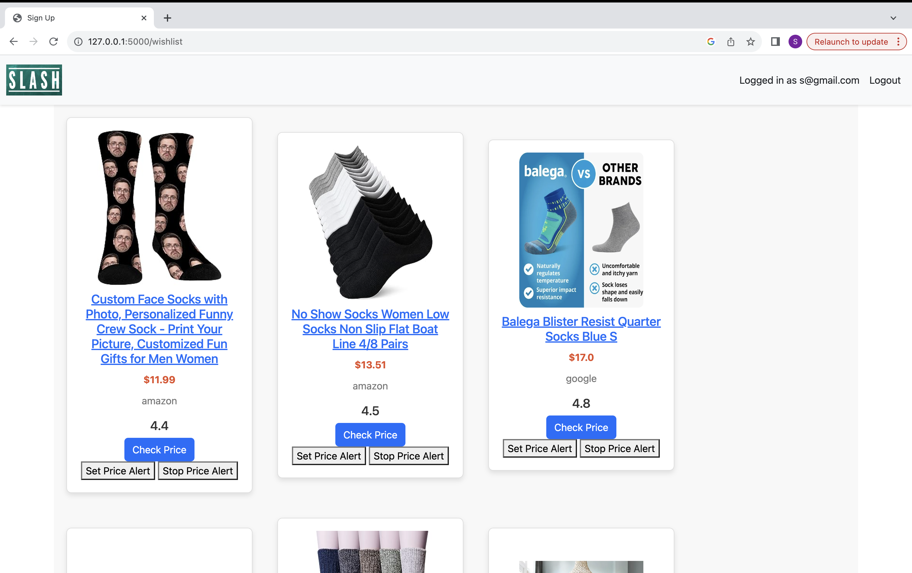
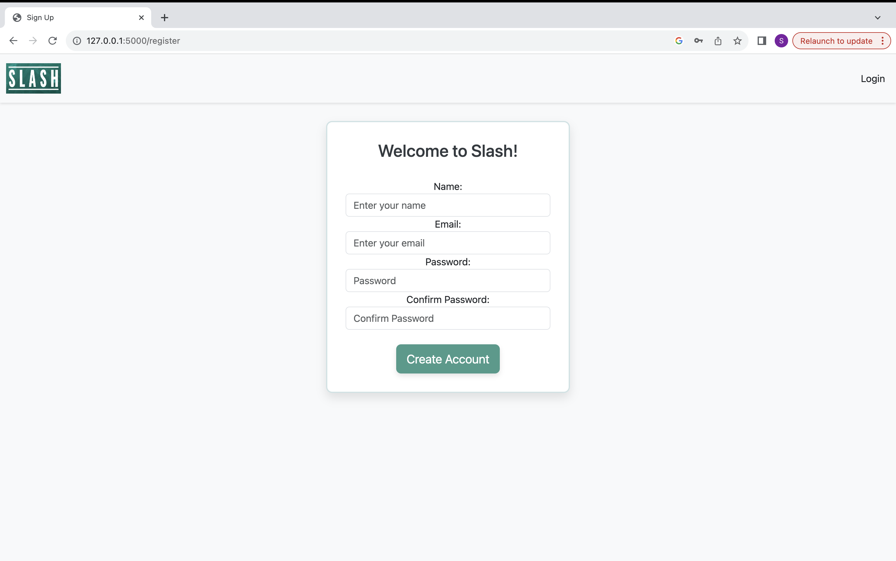
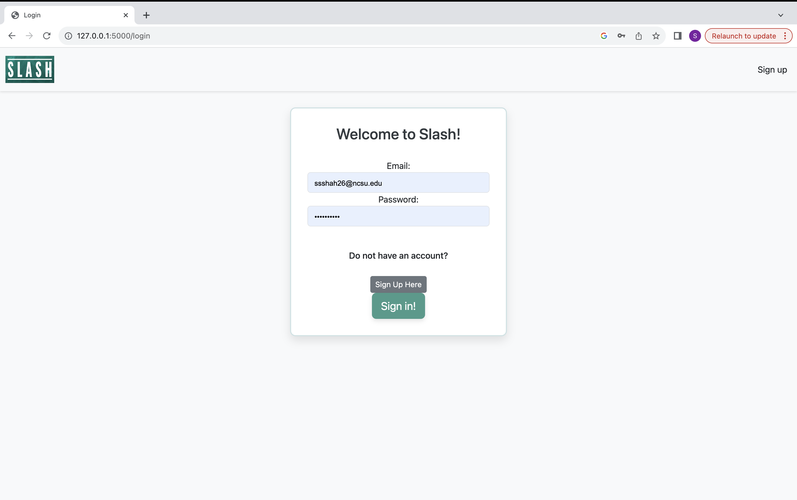

<p align="center"></p>

[](https://github.com/bhavya180301/slash/blob/main/LICENSE)
[](https://zenodo.org/doi/10.5281/zenodo.10211733)


[](https://codecov.io/gh/bhavya180301/slash)
[](https://github.com/bhavya180301/slash/actions/workflows/python-app.yml)
[](https://github.com/bhavya180301/slash/actions/workflows/style_checker.yml)

## Introduction
Meet Slash, not just a tool but a revolution in the world of online shopping. It's designed to transcend the conventional boundaries, promising not only utility but a seamless experience of effortless savings and unparalleled convenience.

## What it Does
Slash redefines how you shop online. No more tedious comparisons across e-commerce platforms—Slash accomplishes it within seconds, giving you back over 50% of your valuable time. Its user-friendly commands make navigating through deals an intuitive and enjoyable process, turning the search for the best deals into a breeze. More than a tool, Slash empowers you with customization, allowing you to tailor your search results instantly. And the excitement doesn't end there—explore our latest releases, the Mini Version and Full Version, ushering in a new era of convenience and efficiency in your online shopping endeavors. Embrace the future of online shopping with Slash, where every click brings you closer to a world of savings and unparalleled satisfaction. Try it now and elevate your online shopping experience!

- 🔄 Easily compare deals across leading e-commerce websites with Slash, streamlining your shopping experience.
- ⏰ Save over 50% of your time by accelerating product search and comparison processes with Slash.
- 🤖 Use simple commands to filter, sort, and search items, ensuring a user-friendly and efficient experience.
- 🎛️ Swiftly modify commands for precise search results, tailoring your shopping experience with ease.
- 🆕 Explore enhanced features and improvements with the latest releases, catering to diverse user preferences.
- ❤️ Easily add desired items to your wishlist for future reference or tracking.
- 💰 Keep track of wishlist items and receive notifications when prices drop, ensuring you never miss a great deal.
- 🌐 Navigate effortlessly from product search to wishlist management, ensuring a smooth shopping journey.
- 🚀 Slash transforms online shopping, making it faster, easier, and more personalized for users with diverse interests.

## Features Added In Phase 5
### UI Improvements: 
- 🔄 Sign Up Page / Login Page: Improved the layout of both pages and navbars to enhance user experience and navigation.
- 🖼️🔍 Landing Page: Enhanced the user interface by incorporating images and suggesting product categories for user searches.
- 🔄 Results Page: Improved the display of the results page by transitioning to a tile format and including product images along with relevant details.
- 🛍️🔄 Wishlist Page: Modified the navigation and layout of the Wishlist page for a more user-friendly experience.
- 🚀 Added Navbar: Introduced a navbar for smoother navigation across different pages.
- 🗂️ Category Page: Implemented a new categories page to enhance the categorization of products.

### Backend Calls:
- 📉 Check Price Drop: Added functionality to check if the price of a wishlisted product has dropped.
- ⏰ Set Price Alert and Stop Price Alert: Implemented the capability for periodic checks on potential price drops in wishlisted items.
- 🌐✅ Website Category Filter: Added a feature to filter products based on one or more websites using checkboxes.
- 📧 Automated Emails on Price Drop: Integrated with the set-price-alert method to notify users via automated email if the price of a wishlisted product drops during periodic checks.

### Additional Features: 
- 📸 Image Scraping: Introduced image scraping along with other product details. 
- ⭐🔢 Number of Ratings: Added a feature to check the number of ratings given to a product, in addition to displaying the rating.
- 🗂️🔄 New Categories Page and Corresponding Backend Calls: Added a new categories page and the necessary backend calls to support it.

### Bugs Fixed:
- 🐜🛠️ Add to Wishlist Function: Initially called inside the filter function, it now has a separate function to avoid filtering results each time a product is added to the wishlist.
- 🚀🗺️ Enhanced UI Navigation: Improved navigation through the incorporation of a navbar to address and resolve existing bugs.
- ✔️📊 Test Coverage: The original test cases were not working, so we have rectified them and added 10 more to achieve a test coverage of 80%.

## Preview
 - Landing Page
    We have enhanced the user interface by incorporating images and suggesting product categories for user searches.
  
  
 - Category Page
    We have implemented a new categories page to enhance the categorization of products.
  
 - Results Page
   We have improved the display of the results page by transitioning to a tile format and including product images along with relevant details.
  
  
 - Wishlist Page
   We have improved the navigation and layout of the Wishlist page for a more user-friendly experience and added check price drop and start and stop price alert functionalities.
  
 - SignUp Page
   We have improved the layout and navbars to enhance user experience and navigation.
  
 - Login Page
   We have improved the layout and navbars to enhance user experience and navigation.
   

## Link to Phase 4 Video: 
[Click here to view video]()

We have used the following technologies were used for the development of this project:  
<p align="left">
  <a href="https://developer.mozilla.org/en-US/docs/Glossary/HTML" target="_blank"> 
    
  </a>
  <a href="https://www.python.org" target="_blank"> 
    
  </a>
  <a href="https://developer.mozilla.org/en-US/docs/Glossary/CSS" target="_blank"> 
    
  </a>
  <a href="https://flask.palletsprojects.com/" target="_blank"> 
    
  </a>
</p>  

## Installation Steps 

1. Access the Github repository from your computer. 
 - First, pre-install [git](https://git-scm.com/) on  your machine. 
 - Then, clone the following repo:
 ```
 https://github.com/bhavya180301/slash.git
 ```
 * Finally, ```cd``` into the local repository.
```
cd slash
```
2. Install the ```requirements.txt```. 
- This project uses Python 3, so make sure that [Python](https://www.python.org/downloads/) and [Pip](https://pip.pypa.io/en/stable/installation/) are preinstalled.
- Install the ```requirements.txt``` file using pip.
```
pip3 install -r requirements.txt
```
3. Running the program

- Use the python command to run the ```slash.py``` file.
```
python3 -m src.slash --search socks
```
- To run UI version, execute the following commands
  * cd src/modules
  * python (Inside the python console, implement these commands sequentially)
  * from app  import app,db    
  * app.app_context().push()
  * db.create_all()
  * from app import Users
  * from app import Wishlist
  * db.session.commit()
<p>

## Code Coverage
We have rectified the original test cases and added 10 more to achieve a test coverage of 80%.

## Future Scope
- Can use selenium driver for smoother and faster scraping process.
- Can include an option to check the availability of products in nearby stores.
- Can shift to nosql database.
- Increase the number of filters. Filter by price range and rating range. 

## Use Case
* ***Students***: Students coming to university are generally on a budget and time constraint and generally spend hours wasting time to search for products on Websites. Slash is the perfect tool for these students that slashes all the unnecessary details on a website and helps them get prices for a product across multiple websites.Make the most of this tool in the upcoming Black Friday Sale.
* ***Data Analysts***: Finding data for any project is one of the most tedious job for a data analyst, and the datasets found might not be the most recent one. Using slash, they can create their own dataset in real time and format it as per their needs so that they can focus on what is actually inportant.


## Contribution
Please refer the CONTRIBUTING.md file for instructions on how to contribute to our repository.

## License
This project is licensed under the MIT License.

## Contributors 

<table>
  <tr>
    <td>Group 21</td>
    <td align="center"><a href="https://github.com/bhavya180301/"><br /><sub><b>Bhavya Harchandani</b></sub></a></td>
    <td align="center"><a href="https://github.com/msethi13/"><br /><sub><b>Mitali Sethi</b></sub></a><br /></td>
    <td align="center"><a href="https://github.com/saxena1701/"><br /><sub><b>Akshat Saxena</b></sub></a><br /></td>
    <td align="center"><a href="https://github.com/sid-ncsu/"><br /><sub><b>Siddharth Shah</b></sub></a><br /></td>
  </tr>
  </table>

## Funding Information
This project has not yet been funded by any source.

## Support
For any queries and help, please reach out to us at: seproject37@gmail.com

